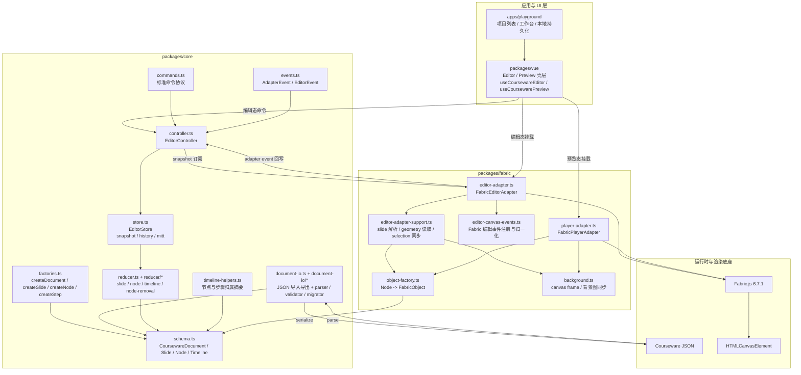
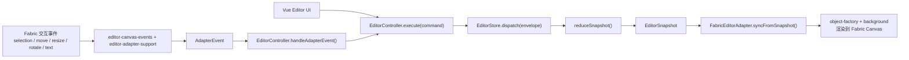

# Canvas Courseware

基于 `packages/core` 与 `packages/fabric` 实际代码整理的系统结构说明。

## 系统结构图



## 编辑态链路



## 播放态链路


## Core / Fabric 树形文件图

以下树形图按当前仓库真实文件结构整理，其中 `src/` 是源码主战场，`dist/` 是打包产物。

### packages/core

```text
packages/core/
├─ package.json                              # core 包清单；声明导出入口、build/typecheck 脚本与 mitt 依赖
├─ tsconfig.json                             # core 包的 TypeScript 编译配置
├─ src/
│  ├─ index.ts                               # core 聚合导出入口；统一 re-export controller、store、schema 等模块
│  ├─ schema.ts                              # 课件领域模型定义；Document / Slide / Node / Timeline / Snapshot 的类型中心
│  ├─ commands.ts                            # 标准命令协议；定义编辑、播放、历史、时间轴等命令结构
│  ├─ events.ts                              # 标准事件协议；定义 AdapterEvent 与 EditorEvent 的边界
│  ├─ factories.ts                           # 默认工厂；创建 document、slide、node、timeline step、animation 等初始对象
│  ├─ document-io.ts                         # 文档导入导出聚合入口；统一暴露 serialize / parse / migrate 公共 API
│  ├─ document-io/
│  │  ├─ parser.ts                          # 文档解析层；负责 JSON 语法恢复、当前 schema 结构解析与节点/步骤静态字段校验
│  │  ├─ validator.ts                       # 文档校验层；负责时间轴、动画、触发对象等跨引用闭环校验
│  │  ├─ migrator.ts                        # 文档迁移层；统一收口 schema 版本判断与后续迁移链路扩展入口
│  │  └─ shared.ts                          # 文档 IO 共享运行时工具；封装 record / enum / number 等基础读取器
│  ├─ controller.ts                          # EditorController；对外收口 execute/undo/redo/adapter event 处理
│  ├─ store.ts                               # EditorStore；维护 snapshot、history、mitt 订阅总线与 dispatch 流程
│  ├─ reducer.ts                             # 根 reducer；按命令类型把状态更新路由到 slide/node/timeline/playback 分支
│  ├─ timeline-helpers.ts                    # 时间轴辅助分析；生成节点与步骤归属摘要，供 UI 直接消费
│  └─ reducer/
│     ├─ shared.ts                           # reducer 通用工具；如 patch 合并、slide 查找、selection 比较、重排索引计算
│     ├─ slide.ts                            # slide 相关归约逻辑；新增、删除、激活、更新、重排页面
│     ├─ timeline.ts                         # timeline 相关归约逻辑；step / animation 的增删改排
│     └─ node-removal.ts                     # 节点删除收敛逻辑；同步清理时间轴引用、空步骤与失效 selection
```

### packages/fabric

```text
packages/fabric/
├─ package.json                              # fabric 适配层包清单；声明对 core 与 fabric.js 的依赖及构建脚本
├─ tsconfig.json                             # fabric 包的 TypeScript 编译配置
├─ src/
│  ├─ index.ts                               # fabric 聚合导出入口；暴露 editor adapter、player adapter 与常量
│  ├─ object-factory.ts                      # Node -> FabricObject 对象工厂；统一创建 text/image/rect 的编辑态与播放态对象
│  ├─ background.ts                          # 画布背景能力；同步 canvas 尺寸、纯色背景与背景图加载/铺放
│  ├─ editor-canvas-events.ts                # 编辑态事件注册器；把 Fabric selection、transform、text、contextmenu 事件统一接线
│  ├─ editor-adapter-support.ts              # 编辑态辅助函数；处理 slide 解析、selection 同步、几何读取、节点元信息挂载
│  ├─ editor-adapter.ts                      # FabricEditorAdapter；把 EditorSnapshot 渲染到编辑画布，并把交互回写为 AdapterEvent
│  └─ player-adapter.ts                      # FabricPlayerAdapter；消费 document + timeline，在预览态执行 trigger、action 与动画

```

## 分层说明

- `packages/core` 是纯文档模型与状态层，不依赖 Fabric；负责 schema、命令协议、快照 store、history、reducer、timeline 归属分析，以及 JSON 导入导出。
- `packages/fabric` 是渲染适配层；编辑态通过 `FabricEditorAdapter` 把 `EditorSnapshot` 映射为画布对象，并把 Fabric 事件归一化后回写到 `EditorController`。
- 预览态不走编辑 controller；`FabricPlayerAdapter` 直接消费 `CoursewareDocument`、按 step trigger 推进，并在适配层内部执行动画。
- `packages/vue` 和 `apps/playground` 只消费 `core` 的标准状态与 `fabric` 的适配器能力，不直接操作 Fabric 对象，符合 PRD 中“UI 层与事件层解耦”的边界约束。
